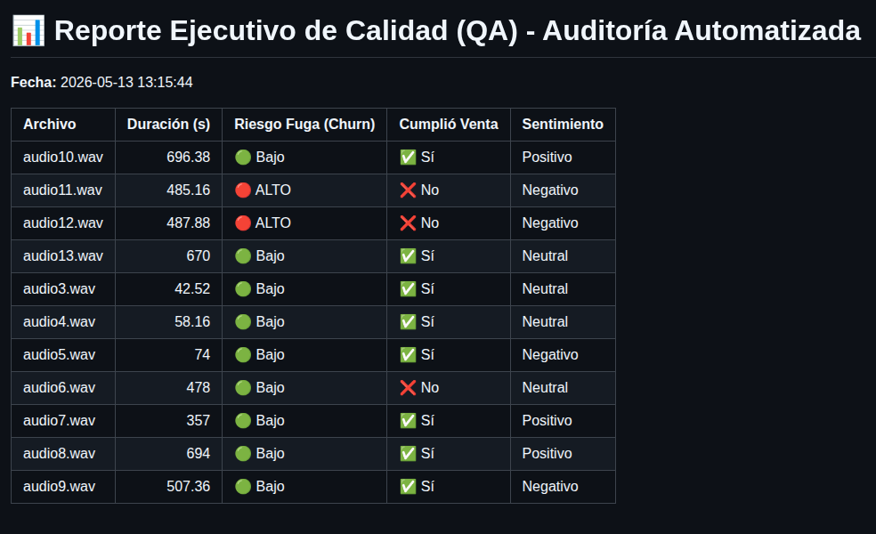

# 🎧 QA-Whisper: Motor de Auditoría Inteligente para Call Centers

Un pipeline de datos asíncrono y 100% local (On-Premise) diseñado para automatizar la auditoría de calidad (QA) de grabaciones de atención al cliente. Utiliza modelos IA de codigo abierto para audio (Speech-to-Text) con Whisper de OpenIA y procesamiento de lenguaje natural (LLMs) con Qwen de Alibaba para evaluar métricas de negocio sin intervención humana.

##  El Problema de Negocio
Los Call Centers corporativos procesan miles de llamadas diarias, pero los supervisores humanos solo pueden auditar manualmente entre el 1% y el 2% de ellas. Esto genera "puntos ciegos" críticos:
* Incumplimiento de guiones comerciales (no ofrecer tarjetas, seguros, etc.).
* Fugas de clientes (Churn) o amenazas legales (Indecopi) que no se detectan a tiempo.
* Alto costo y riesgo legal al enviar audios confidenciales a APIs públicas (Google Cloud, OpenAI) para su análisis.

##  La Solución Arquitectónica
Este proyecto implementa una arquitectura de dos fases (Ingesta Analítica y Razonamiento Semántico) procesada enteramente en el servidor local de la empresa, garantizando **cero fugas de datos (Zero Data Leakage)**.

###  Características Clave
* **Procesamiento de Audio Optimizado:** Utiliza `faster-whisper` (CTranslate2) para transcribir audios de forma acelerada usando CPU, reduciendo drásticamente los costos de hardware.
* **Extracción Estructurada (JSON):** Desacopla el audio del análisis convirtiendo las llamadas en objetos JSON que retienen metadatos vitales (duración, idioma, marcas de tiempo).
* **Análisis NLP (Zero-Shot):** En lugar de depender de reglas clásicas (RegEx) o diccionarios que fallan con el sarcasmo, utiliza **Qwen 2.5** (vía Ollama) para razonamiento semántico avanzado, detectando intención de fuga y sentimiento real.
* **Reportes Ejecutivos Automatizados:** Transforma los resultados en un DataFrame de Pandas, exportando reportes en formato CSV (para análisis en Excel/BI) y Markdown.

## 🛠️ Stack Tecnológico
* **Motor de Transcripción:** `faster-whisper` (OpenAI Whisper optimizado).
* **Inteligencia Artificial (LLM):** Qwen 2.5 (Ejecutado localmente vía `Ollama`).
* **Lenguaje & Transformación:** Python 3, `pandas`, `json`, `requests`.
* **Manejo de Archivos:** `glob`, `os` (Lectura dinámica por lotes).

## Cómo ejecutar este proyecto localmente

1. **Preparar el entorno IA:**
   Asegúrate de tener [Ollama](https://ollama.ai/) instalado y descarga el modelo Qwen:
   ```bash
   ollama pull qwen2.5

```

2. **Instalar dependencias de Python:**
```bash
pip install faster-whisper pandas requests

```


3. **Cargar los datos:**
Coloca tus archivos de audio de Call Center (en formato `.wav`, preferiblemente a 16kHz y Mono) dentro de la carpeta `Audios/`.
4. **Ejecutar el Pipeline:**
* **Paso 1 (Ingesta):** Extrae el texto y los metadatos a formato JSON.
```bash
python3 transcriptor.py

```


* **Paso 2 (Auditoría IA):** Analiza el contexto y genera el reporte comercial.
```bash
python3 auditor.py

```

##  Output (Reporte Ejecutivo)

El sistema generará automáticamente un archivo `Reporte_QA_CallCenter.md` y un `.csv` con la siguiente estructura:



---

> **Autor:** Jimmy Cristhian Cjuro Apaza
> *Estudiante de Ingeniería de Software | UNMSM*
> *Desarrollador enfocado en Data Engineering y Soluciones de IA aplicadas a la Industria.*
git
```

```